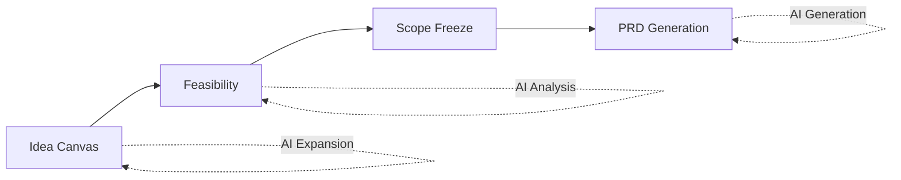

# DecisionOS

A single-user, single-workspace decision management system for product ideas. DecisionOS guides you through a structured workflow from initial idea to production-ready PRD.

## Overview

DecisionOS helps product managers and indie hackers make better decisions by providing a structured framework for:

- **Exploring ideas** via an interactive DAG (Directed Acyclic Graph) canvas
- **Evaluating feasibility** with AI-assisted analysis
- **Freezing scope** to create clear boundaries
- **Generating PRDs** with full context from previous stages

### Decision Flow



## Features

- **Idea Canvas**: Visual DAG-based ideation with AI-powered node expansion
- **Feasibility Analysis**: Compare multiple implementation plans with AI assistance
- **Scope Management**: Define IN/OUT scope with versioned baselines
- **PRD Generation**: Generate structured product requirements with full context
- **Multi-Idea Support**: Manage multiple ideas within a single workspace

## Tech Stack

| Layer    | Technology                                               |
| -------- | -------------------------------------------------------- |
| Frontend | Next.js 14 (App Router), React, TypeScript, Tailwind CSS |
| Backend  | FastAPI, Python 3.12, Pydantic                           |
| Database | SQLite (with Postgres migration path)                    |
| AI       | ModelScope / Auto (configurable providers)               |

## Project Structure

```text
.
├── frontend/          # Next.js 14 frontend
│   ├── app/          # App Router pages
│   ├── components/   # React components
│   └── lib/          # Utilities, API clients, store
├── backend/          # FastAPI backend
│   └── app/
│       ├── core/     # Auth, settings, LLM gateway
│       ├── db/       # Models, repositories
│       ├── routes/   # API endpoints
│       └── schemas/  # Pydantic schemas
├── docker-compose.yml
└── package.json      # Root workspace config
```

## Quick Start (Local Development)

### Prerequisites

- Node.js 20+
- Python 3.12+
- pnpm
- uv (Python package manager)

### 1. Clone and Install

```bash
# Install frontend dependencies
pnpm install

# Setup Python environment
cd backend
uv venv .venv
UV_CACHE_DIR=../.uv-cache uv pip install -r requirements.txt
```

### 2. Configure Environment

Create a `.env` file in the project root:

```bash
# Required: Admin credentials (no defaults provided)
export DECISIONOS_SEED_ADMIN_USERNAME=admin
export DECISIONOS_SEED_ADMIN_PASSWORD=your-secure-password-here

# Optional
export LLM_MODE=mock              # mock | auto | modelscope
export DECISIONOS_SECRET_KEY=your-secret-key
```

> ⚠️ **Security**: You MUST set admin credentials via environment variables. The application will fail to start without them.

### 3. Start Backend

```bash
cd backend
UV_CACHE_DIR=../.uv-cache uv run --python .venv/bin/python uvicorn app.main:app --reload --host 127.0.0.1 --port 8000
```

### 4. Start Frontend

```bash
pnpm dev:web
```

Visit `http://localhost:3000` and login with your configured admin credentials.

## Deployment

### Docker Compose (Recommended)

```bash
# Set required environment variables
export DECISIONOS_SEED_ADMIN_USERNAME=admin
export DECISIONOS_SEED_ADMIN_PASSWORD=your-secure-password

# Start services
docker compose up --build -d
```

Access:

- Frontend: http://localhost:3000
- Backend API: http://localhost:8000
- API Docs: http://localhost:8000/docs

### Coolify

1. Create a new Docker Compose service pointing to this repo
2. Configure environment variables:
   - `NEXT_PUBLIC_API_BASE_URL=https://<your-api-domain>`
   - `DECISIONOS_CORS_ORIGINS=https://<your-web-domain>`
   - `DECISIONOS_SECRET_KEY=<strong-random-secret>`
   - `DECISIONOS_SEED_ADMIN_USERNAME=<admin-username>` (required)
   - `DECISIONOS_SEED_ADMIN_PASSWORD=<strong-password>` (required)
   - `LLM_MODE=mock` (or `auto` for production)
3. Expose `web` (port 3000) and `api` (port 8000) with their own domains

> **Note**: SQLite is persisted via named volume `decisionos_data` mounted at `/data`.

## Configuration

### Required Environment Variables

| Variable                         | Description    | Example         |
| -------------------------------- | -------------- | --------------- |
| `DECISIONOS_SEED_ADMIN_USERNAME` | Admin username | `admin`         |
| `DECISIONOS_SEED_ADMIN_PASSWORD` | Admin password | `change-me-now` |

### Optional Environment Variables

| Variable                              | Default                           | Description                              |
| ------------------------------------- | --------------------------------- | ---------------------------------------- |
| `DECISIONOS_DB_PATH`                  | `./decisionos.db`                 | SQLite database path                     |
| `DECISIONOS_SECRET_KEY`               | `decisionos-dev-secret-change-me` | Encryption key for secrets               |
| `DECISIONOS_CORS_ORIGINS`             | `http://localhost:3000`           | Comma-separated allowed origins          |
| `DECISIONOS_AUTH_DISABLED`            | `false`                           | Disable auth (dev only)                  |
| `DECISIONOS_AUTH_SESSION_TTL_SECONDS` | `43200`                           | Session timeout (12 hours)               |
| `LLM_MODE`                            | `auto`                            | AI mode: `mock`, `auto`, or `modelscope` |

### Seed Users

Two seed users are created on first startup:

- **Admin**: Required, credentials from environment variables
- **Test**: Optional, defaults to `test`/`test` (configurable via env)

## Core Concepts

### Decision Stages

1. **Idea Canvas**: Explore ideas using a visual DAG. Start with a seed, expand nodes using AI patterns (narrow audience, expand features, scenario shift, etc.), and confirm a path.

2. **Feasibility**: Evaluate multiple implementation approaches. AI generates plans with effort estimates, trade-offs, and recommendations. Select one plan to proceed.

3. **Scope Freeze**: Define clear IN/OUT scope. Create versioned baselines. Once frozen, scope becomes immutable for PRD generation.

4. **PRD Generation**: Generate structured PRDs with:
   - Markdown narrative
   - Requirements breakdown
   - Backlog items linked to requirements
   - Full context from previous stages

### Authentication

- Bearer token-based authentication
- Sessions stored in database with configurable TTL
- Tokens are hashed using SHA-256 before storage
- Passwords use PBKDF2-SHA256 with random salt (210,000 iterations)

## API Documentation

When the backend is running, visit:

```
http://localhost:8000/docs
```

This provides interactive OpenAPI/Swagger documentation with all endpoints, request/response schemas, and authentication requirements.

## Development

### Frontend

```bash
pnpm dev:web      # Development server
pnpm build:web    # Production build
```

### Backend

```bash
# Type checking
UV_CACHE_DIR=../.uv-cache uv run --python .venv/bin/python mypy app

# Run tests
UV_CACHE_DIR=../.uv-cache uv run --python .venv/bin/python pytest
```

### Code Style

- Frontend: Prettier + ESLint (enforced via Husky pre-commit hooks)
- Backend: Follow PEP 8, type hints required

## Architecture Decisions

### SQLite for Single-User

SQLite is chosen for simplicity in single-user deployments. The schema is designed to be migration-friendly for future Postgres support.

### Optimistic Locking

All mutating operations use version-based optimistic locking to prevent concurrent modification issues.

### Context as JSON

Idea context is stored as JSON with schema versioning. This allows flexible evolution of the data model while maintaining backward compatibility.

## License

MIT
