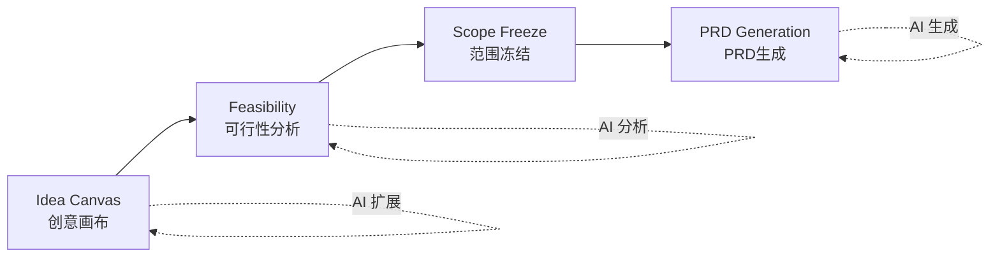

# DecisionOS

面向产品创意的单用户、单工作区决策管理系统。DecisionOS 引导你通过结构化工作流，从初始创意到生成可用于生产的 PRD。

> 🌐 [English](README.md) | **中文**

## 项目简介

DecisionOS 为产品经理和独立开发者提供结构化框架，帮助做出更好的决策：

- **探索创意**：通过交互式 DAG（有向无环图）画布
- **评估可行性**：AI 辅助分析
- **冻结范围**：创建清晰的边界
- **生成 PRD**：基于前序阶段的完整上下文

### 决策流程



## 功能特性

- **创意画布（Idea Canvas）**：可视化 DAG 创意探索，支持 AI 驱动的节点扩展
- **可行性分析（Feasibility）**：并发生成三个实施方案，通过 SSE 流式传输逐步呈现，对比 AI 辅助评估结果
- **范围管理（Scope Management）**：定义 IN/OUT 范围，支持版本化基线
- **PRD 生成**：基于完整上下文生成结构化产品需求文档
- **多创意管理**：在单一工作区内管理多个创意

## 技术架构

| 层级   | 技术栈                                                   |
| ------ | -------------------------------------------------------- |
| 前端   | Next.js 14 (App Router), React, TypeScript, Tailwind CSS |
| 后端   | FastAPI, Python 3.12, Pydantic                           |
| 数据库 | SQLite（支持迁移至 Postgres）                            |
| AI     | ModelScope / Auto（可配置提供商）                        |

## 项目结构

```text
.
├── frontend/          # Next.js 14 前端
│   ├── app/          # App Router 页面
│   ├── components/   # React 组件
│   └── lib/          # 工具函数、API 客户端、状态管理
├── backend/          # FastAPI 后端
│   └── app/
│       ├── core/     # 认证、配置、LLM 网关
│       ├── db/       # 模型、数据仓库
│       ├── routes/   # API 接口
│       └── schemas/  # Pydantic 模型
├── docker-compose.yml
└── package.json      # 根工作区配置
```

## 快速开始（本地开发）

### 前置条件

- Node.js 20+
- Python 3.12+
- pnpm
- uv（Python 包管理器）

### 1. 克隆与安装

```bash
# 安装前端依赖
pnpm install

# 配置 Python 环境
cd backend
uv venv .venv
UV_CACHE_DIR=../.uv-cache uv pip install -r requirements.txt
```

### 2. 配置环境变量

在项目根目录创建 `.env` 文件：

```bash
# 必需：管理员凭据（不提供默认值）
export DECISIONOS_SEED_ADMIN_USERNAME=admin
export DECISIONOS_SEED_ADMIN_PASSWORD=your-secure-password-here

# 可选
export LLM_MODE=mock              # mock | auto | modelscope
export DECISIONOS_SECRET_KEY=your-secret-key
```

> ⚠️ **安全提示**：必须通过环境变量设置管理员凭据，否则应用将无法启动。

> **本地开发跨域**：前端通过 Next.js rewrites 将所有 `/api-proxy/*` 请求代理到 `http://127.0.0.1:8000`，本地开发无需配置 CORS。`NEXT_PUBLIC_API_BASE_URL` 仅在生产/Docker 部署时需要设置。

### 3. 启动后端

```bash
cd backend
UV_CACHE_DIR=../.uv-cache uv run --python .venv/bin/python uvicorn app.main:app --reload --host 127.0.0.1 --port 8000
```

### 4. 启动前端

```bash
pnpm dev:web
```

访问 `http://localhost:3000`，使用配置的管理员凭据登录。

## 部署指南

### Docker Compose（推荐）

```bash
export DECISIONOS_SEED_ADMIN_USERNAME=admin
export DECISIONOS_SEED_ADMIN_PASSWORD=your-secure-password
export LLM_MODE=auto   # 测试可用 mock

docker compose up --build -d
```

访问地址：

- 前端：http://localhost:3000
- 后端 API：http://localhost:8000
- API 文档：http://localhost:8000/docs

**Docker 内部代理原理**：`web` 容器构建时设置 `API_INTERNAL_URL=http://api:8000`。浏览器所有请求发往 `http://localhost:3000/api-proxy/...`，Next.js 在服务端将其转发到 `api` 容器的内部网络，无 CORS 问题，后端端口无需暴露给浏览器。

> **注意**：SQLite 通过命名卷 `decisionos_data` 挂载到 `/data` 进行持久化。

### Coolify 部署

`web` 和 `api` 以单个 Docker Compose 栈运行。只需对外暴露 `web` 服务（端口 3000）—— `api` 容器由代理通过内部网络访问，无需公开域名。

必需的环境变量：

| 变量名                           | 值                                    |
| -------------------------------- | ------------------------------------- |
| `DECISIONOS_SEED_ADMIN_USERNAME` | 管理员用户名                          |
| `DECISIONOS_SEED_ADMIN_PASSWORD` | 强密码                                |
| `DECISIONOS_SECRET_KEY`          | 随机密钥（如 `openssl rand -hex 32`） |
| `LLM_MODE`                       | `auto`（或 `modelscope`）             |

可选但推荐：

| 变量名                    | 值                                               |
| ------------------------- | ------------------------------------------------ |
| `DECISIONOS_CORS_ORIGINS` | `http://localhost:3000`（仅暴露 web 时默认即可） |
| `API_INTERNAL_URL`        | `http://api:8000`（默认值，通常无需修改）        |

操作步骤：

1. 在 Coolify 中创建 **Docker Compose** 服务，指向本仓库
2. 填写上述环境变量
3. 仅将 `web` 服务的 3000 端口绑定到你的域名
4. `api` 服务的 8000 端口**不需要**公开域名，通过 `http://api:8000` 内部访问

## 配置说明

### 必需的环境变量

| 变量名                           | 说明         | 示例            |
| -------------------------------- | ------------ | --------------- |
| `DECISIONOS_SEED_ADMIN_USERNAME` | 管理员用户名 | `admin`         |
| `DECISIONOS_SEED_ADMIN_PASSWORD` | 管理员密码   | `change-me-now` |

### 可选的环境变量

| 变量名                                | 默认值                            | 说明                                                            |
| ------------------------------------- | --------------------------------- | --------------------------------------------------------------- |
| `DECISIONOS_DB_PATH`                  | `./decisionos.db`                 | SQLite 数据库路径                                               |
| `DECISIONOS_SECRET_KEY`               | `decisionos-dev-secret-change-me` | 密钥加密密钥                                                    |
| `DECISIONOS_CORS_ORIGINS`             | `http://localhost:3000`           | 允许的跨域来源，逗号分隔                                        |
| `DECISIONOS_AUTH_DISABLED`            | `false`                           | 禁用认证（仅开发环境）                                          |
| `DECISIONOS_AUTH_SESSION_TTL_SECONDS` | `43200`                           | 会话超时时间（12小时）                                          |
| `LLM_MODE`                            | `auto`                            | AI 模式：`mock`、`auto` 或 `modelscope`                         |
| `API_INTERNAL_URL`                    | `http://127.0.0.1:8000`           | Next.js 服务端调用后端的地址（Docker 中设为 `http://api:8000`） |

### Seed 用户

首次启动时创建两个种子用户：

- **管理员（Admin）**：必需，凭据来自环境变量
- **测试用户（Test）**：可选，默认 `test`/`test`（可通过环境变量配置）

## 核心概念

### 决策阶段

1. **创意画布（Idea Canvas）**：使用可视化 DAG 探索创意。从种子开始，使用 AI 模式（缩小受众、扩展功能、场景迁移等）扩展节点，并确认一条路径。

2. **可行性分析（Feasibility）**：并发评估三种实现方案（自举/轻资产、VC 融资/增长优先、平台/生态系统）。各方案通过 SSE 流式到达时立即展示，生成期间显示骨架屏占位。选择一个方案继续。

3. **范围冻结（Scope Freeze）**：明确 IN/OUT 范围。创建版本化基线。一旦冻结，范围对 PRD 生成即为不可变。

4. **PRD 生成**：生成结构化 PRD，包含：
   - Markdown 叙述文档
   - 需求分解
   - 关联到需求的待办事项
   - 前序阶段的完整上下文

### 认证系统

- 基于 Bearer Token 的认证
- 会话以可配置 TTL 存储在数据库中
- Token 存储前使用 SHA-256 哈希
- 密码使用 PBKDF2-SHA256 配合随机盐（21万次迭代）

## API 文档

后端运行时，访问：

```
http://localhost:8000/docs
```

提供交互式 OpenAPI/Swagger 文档，包含所有接口、请求/响应模型和认证要求。

## 开发指南

### 前端

```bash
pnpm dev:web      # 开发服务器
pnpm build:web    # 生产构建
```

### 后端

```bash
# 类型检查
UV_CACHE_DIR=../.uv-cache uv run --python .venv/bin/python mypy app

# 运行测试
UV_CACHE_DIR=../.uv-cache uv run --python .venv/bin/python pytest
```

### 代码规范

- 前端：Prettier + ESLint（通过 Husky pre-commit 钩子强制执行）
- 后端：遵循 PEP 8，要求类型注解

## 架构决策

### 单用户使用 SQLite

为简化单用户部署而选择 SQLite。数据库模式设计便于未来迁移至 Postgres。

### 乐观锁

所有修改操作使用基于版本的乐观锁，防止并发修改问题。

### JSON 存储上下文

创意上下文以 JSON 格式存储并带版本控制。这允许数据模型灵活演进，同时保持向后兼容。

## 许可证

MIT
